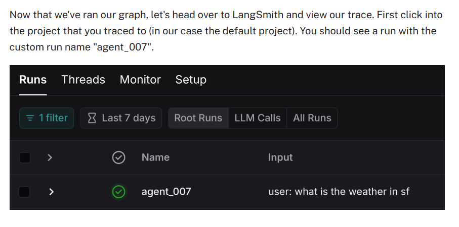
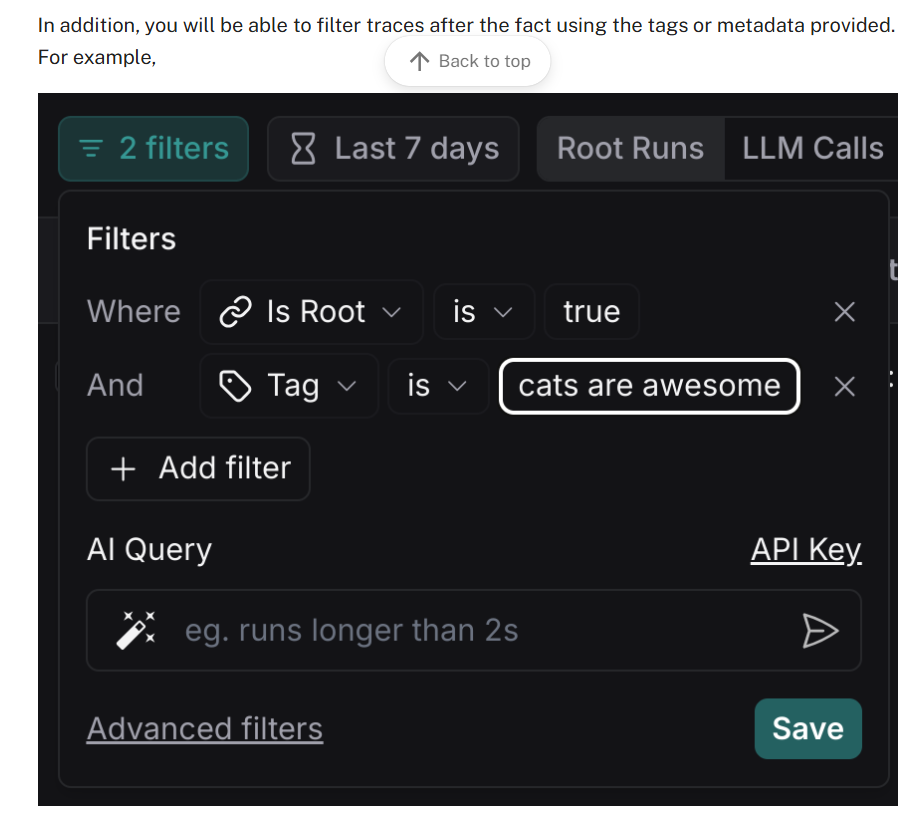

# 3. How to pass custom run ID or set tags and metadata for graph runs in LangSmith

### **How to Pass Custom Run ID or Set Tags and Metadata for Graph Runs in LangSmith**

LangSmith provides a powerful platform for debugging and monitoring your LangGraph-based applications, which are built using LangChain and LangGraph. One of the useful features in LangSmith is the ability to trace graph runs with custom run IDs, tags, and metadata. These features are especially helpful when you're working with multiple tasks, agents, or complex workflows, making it easy to identify specific runs and analyze them effectively.

Let's break down the steps for setting and passing custom configurations (such as `run_id`, `tags`, and `metadata`) during graph runs in LangSmith.

### 🎯 **Purpose of Custom Run ID, Tags, and Metadata**

In the context of LangSmith, **run IDs**, **tags**, and **metadata** help you organize and track your graph runs efficiently. Here's a quick overview of each:

- **run_id**: A unique identifier for each run, which helps you pinpoint specific traces.
- **tags**: These are labels or keywords you can assign to specific runs. Tags can help you group related runs and filter results later.
- **metadata**: Metadata provides additional context about the run, such as timestamps, environment variables, or any other relevant information you want to attach to the trace.

### 🔧 **Configuration Example**

Before diving into the code, ensure that you have set up LangSmith with your API keys, as shown in the previous steps.

Now, let's walk through the code to implement custom `run_id`, `tags`, and `metadata`.

### 💻 **Code Example**

```python
import uuid
from langchain_openai import ChatOpenAI
from langgraph.prebuilt import create_react_agent
from langchain_core.tools import tool

# Initialize the OpenAI model
model = ChatOpenAI(model="gpt-4", temperature=0)

# Define a custom tool to get weather information
@tool
def get_weather(city: str):
    """Return weather information for a given city."""
    if city == "nyc":
        return "It might be cloudy in NYC."
    elif city == "sf":
        return "It's always sunny in SF."
    else:
        raise AssertionError("Unknown city")

tools = [get_weather]

# Create the ReAct agent
graph = create_react_agent(model, tools=tools)

# Set up the inputs for the agent
inputs = {"messages": [("user", "what is the weather in SF?")]}

# Create a configuration with a custom run_id and tags
config = {
    "run_name": "agent_007",  # Custom name for the run
    "tags": ["weather-query", "sf-weather"],  # Tags to categorize the run
    "metadata": {"env": "production", "user": "unza"},  # Metadata with additional context
}

# Function to print the stream output
def print_stream(stream):
    for s in stream:
        message = s["messages"][-1]
        if isinstance(message, tuple):
            print(message)
        else:
            message.pretty_print()

# Run the graph with the provided configuration
print_stream(graph.stream(inputs, config, stream_mode="values"))
```

### 🔍 **Explanation of Code**

1. **Importing Required Libraries**:
   - We first import `uuid`, which helps in generating unique run IDs.
   - We import `ChatOpenAI` to use OpenAI's model, `create_react_agent` to create an agent, and `tool` to define a custom tool.

2. **Initializing the Model**:
   - We initialize the OpenAI model (`gpt-4`) with a temperature setting of `0` (for deterministic responses).

3. **Defining a Custom Tool**:
   - The `get_weather` function is decorated with the `@tool` decorator, which makes it available as a callable tool for the agent. This function returns weather information for cities based on the input.

4. **Creating the Agent**:
   - We create the agent (`graph`) using `create_react_agent` and provide it with the model and the weather tool.

5. **Setting Up Inputs**:
   - The `inputs` variable holds the user query, "What is the weather in SF?". This is the input that the agent will process.

6. **Configuring Run with Custom Parameters**:
   - The `config` dictionary includes:
     - `run_name`: Custom name to identify this specific run ("agent_007").
     - `tags`: Labels to categorize the run, such as "weather-query" and "sf-weather".
     - `metadata`: Additional contextual data, such as the environment (`production`) and the user name (`unza`).

7. **Running the Graph**:
   - We use the `graph.stream` method to run the agent with the provided `inputs` and `config`.
   - The `stream_mode="values"` tells LangSmith to return the values as they are generated.

8. **Printing the Output**:
   - The `print_stream` function prints each message in the output stream, making it easier to see the response from the agent, which in this case is the weather information for San Francisco.

### 🌐 **Real-World Use Case**

In a real-world application, you could use this setup for a variety of use cases where tracking and debugging graph runs are essential. For example:

- **Customer Support Systems**: If you're building an AI-based customer support agent, each conversation could have its own `run_id`, `tags` (like "customer-support", "billing-query"), and `metadata` (such as user ID, session ID). This would allow you to trace specific customer interactions, debug issues, and track performance.
  
- **Automated Weather Systems**: In weather forecasting systems, you might want to track individual weather queries with `run_ids` for analysis or reporting. By tagging them with "weather-query" and "SF-weather", you could quickly filter and analyze the results of specific weather-related runs.

### 🏷 **Setting and Filtering Traces**

Once you've passed a custom `run_id`, `tags`, and `metadata`, you can use LangSmith's powerful filtering capabilities to easily track and analyze your graph runs. You can filter based on:

- **run_name**: Search for runs with a specific name.
- **tags**: Filter by tags like "weather-query", "support-query", etc.
- **metadata**: Filter by metadata fields such as user or session ID.

This feature makes it simple to isolate relevant traces, identify issues, and monitor performance across different runs.

---

Let me know if you need further details or a specific example related to your project!





---

# 🏷️ How to Pass Custom Run ID or Set Tags and Metadata for Graph Runs in LangSmith

LangSmith is a powerful platform for **debugging**, **testing**, and **monitoring** your LangGraph-based applications. It allows you to **trace** each run (or execution) of your application so you can review the sequence of events, tools used, and the outputs generated. By assigning **custom run IDs**, **tags**, and **metadata** to each run, you can easily filter and locate specific runs in the LangSmith interface.

In this guide, we’ll walk through how to configure and view these custom attributes for a **LangGraph** that uses a **ReAct agent** and an **OpenAI** model. We’ll also explore a **real-world example** of where this concept might be useful.

---

## 🌐 Why Use Custom Run IDs, Tags, and Metadata?

- **Custom Run IDs**: Assigning a unique ID to each run makes it straightforward to reference or retrieve a specific run later. 
- **Tags**: Tags act like labels or categories. For example, you could label runs with `"production"` vs. `"development"`, or `"weather_query"` vs. `"stock_query"`.
- **Metadata**: Store additional information (like user IDs, timestamps, environment variables, or other contextual data) in a structured way. This can be especially helpful for auditing, debugging, or analytics.

**Real-World Example**  
Imagine you’re running a **customer support chatbot**. You might tag each run with `"billing_support"` or `"technical_issue"`, and add metadata such as `{"user_id": 12345, "priority": "high"}`. Later, you can filter or search for all runs related to high-priority technical issues, speeding up debugging and analytics.

---

# 1. ⚙️ Setup

Before we start, ensure you have:

1. **Python** installed.
2. **LangSmith** account with an API key.
3. **OpenAI** account with an API key (if using OpenAI’s models).

### **Installing Required Packages**

```bash
%%capture --no-stderr
%pip install --quiet -U langgraph langchain_openai
```

**What this does:**  
- Installs the latest versions of `langgraph` and `langchain_openai` libraries, which we need for creating our graph and connecting to OpenAI.

### **Setting Environment Variables**

```python
import getpass
import os

def _set_env(var: str):
    if not os.environ.get(var):
        os.environ[var] = getpass.getpass(f"{var}: ")

_set_env("OPENAI_API_KEY")
_set_env("LANGSMITH_API_KEY")
```

**Explanation:**  
- `OPENAI_API_KEY`: Allows your code to authenticate with OpenAI’s API.  
- `LANGSMITH_API_KEY`: Allows your code to send run traces to your LangSmith account.

You can also set these environment variables directly in your system or IDE.

---

# 2. 🏗️ Defining the Graph

Next, we create a **ReAct agent** that uses an OpenAI model and a simple tool for retrieving weather information. This agent will demonstrate how we can trace runs in LangSmith.

```python
from langchain_openai import ChatOpenAI
from typing import Literal
from langgraph.prebuilt import create_react_agent
from langchain_core.tools import tool

# 1. Initialize the model we want to use
model = ChatOpenAI(model="gpt-4o", temperature=0)

# 2. Create a custom tool to return pre-defined values for weather in two cities
@tool
def get_weather(city: Literal["nyc", "sf"]):
    """Use this to get weather information."""
    if city == "nyc":
        return "It might be cloudy in nyc"
    elif city == "sf":
        return "It's always sunny in sf"
    else:
        raise AssertionError("Unknown city")

# 3. Put tools in a list
tools = [get_weather]

# 4. Define the graph using a prebuilt ReAct agent
graph = create_react_agent(model, tools=tools)
```

### **Code Explanation:**

1. **`ChatOpenAI(model="gpt-4o", temperature=0)`**  
   - Creates an instance of OpenAI’s GPT-4-like model with a temperature of 0 (which makes responses more deterministic).

2. **`@tool`**  
   - Decorator that turns a function into a “tool” the agent can call. Here, `get_weather` returns a string describing the weather for NYC or SF.

3. **`create_react_agent(model, tools=tools)`**  
   - Generates a ReAct-style agent that can decide when to call the `get_weather` tool and when to produce a final answer. This agent is wrapped in a “graph” object.

---

# 3. 🚀 Running the Graph with Custom Config

Now we want to run our graph and send **custom run information**—such as a run name, tags, and metadata—to LangSmith. This helps us **organize and filter** runs later.

```python
import uuid

def print_stream(stream):
    for s in stream:
        # The 'messages' key holds a list of messages. The last message is the latest output.
        message = s["messages"][-1]
        if isinstance(message, tuple):
            print(message)
        else:
            message.pretty_print()

# 1. Define the user input
inputs = {"messages": [("user", "what is the weather in sf")]}

# 2. Create a config dictionary with run_name, tags, and metadata
config = {
    "run_name": "agent_007",           # Custom name for the run
    "tags": ["cats are awesome"],      # Tags to help categorize or filter runs
    # "metadata": {"example_key": "example_value"} # (Optional) Additional data
}

# 3. Invoke the graph with streaming
print_stream(graph.stream(inputs, config, stream_mode="values"))
```

### **Code Explanation (Line by Line):**

1. **`import uuid`**  
   - (Optional) You could use `uuid.uuid4()` to generate a unique run ID if you want each run to have a truly unique identifier.

2. **`def print_stream(stream): ...`**  
   - This helper function prints out the stream of messages produced by the agent. Each step in the conversation is represented as a separate message.

3. **`inputs = {"messages": [("user", "what is the weather in sf")]}`**  
   - This is the input to the agent, which includes a user message asking about the weather in SF.

4. **`config = {...}`**  
   - **`run_name`:** Sets a custom name (“agent_007”) for this run, so you can easily find it later in LangSmith.  
   - **`tags`:** Assigns one or more tags (here, `"cats are awesome"`) to label or categorize this run.  
   - **`metadata`:** You can optionally include a dictionary with extra data (e.g., `{"example_key": "example_value"}`).

5. **`graph.stream(inputs, config, stream_mode="values")`**  
   - This line **executes** the graph with the given input and configuration. The `stream_mode="values"` parameter ensures the function yields the conversation messages as they’re generated.

---

# 4. 👀 Viewing the Trace in LangSmith

Once you’ve run your graph, you can head over to your **LangSmith** dashboard:

1. **Open your LangSmith Project**: By default, traces go to the “default” project unless you specify otherwise.
2. **Look for the Custom Run Name**: You should see a run named **“agent_007”** (from our config).
3. **Filter by Tags**: If you added tags like `["cats are awesome"]`, you can use them in LangSmith’s UI to filter or search for runs with these tags.
4. **Metadata**: Any metadata you include can also be used to filter or provide context in your trace logs.

**Example**: In the LangSmith UI, you might see a run with:  
- **Run Name**: `agent_007`  
- **Tags**: `[ "cats are awesome" ]`  
- **Messages**:  
  - Human: “What is the weather in sf?”  
  - Tool Call: “get_weather” with args `{ city: "sf" }`  
  - Tool Response: “It's always sunny in sf”  
  - AI: “The weather in San Francisco is currently sunny.”

---

# 5. 🌍 Real-World Example

### **Customer Support Bot**

Imagine you have a **customer support bot** that handles thousands of conversations every day. You might:

- Set **run_name** to something like `"support_conversation_{ticket_id}"`.
- Add **tags** such as `["billing", "refund", "technical"]` to categorize the type of inquiry.
- Include **metadata** like `{"customer_id": 12345, "priority": "high"}` to track who the customer is and how urgent their issue is.

Later, if you need to **debug** or **analyze** all high-priority technical issues, you can filter by:

- **Tags**: `technical`  
- **Metadata**: `priority: high`

This approach helps you quickly locate the relevant runs in LangSmith.

---

# 🏁 Summary

1. **Custom Run IDs**: Make each run uniquely identifiable.  
2. **Tags**: Help categorize runs, allowing you to group and filter them in the LangSmith dashboard.  
3. **Metadata**: Store additional context about each run (like environment details, user info, or timestamps).

By **passing a custom configuration** (`run_name`, `tags`, and optional `metadata`) to the `invoke`, `stream`, or other LangGraph methods, you can keep your runs organized and easily searchable in LangSmith. This setup is crucial when dealing with large or complex applications where debugging and analytics become more challenging.

---

**That’s it!** You’ve learned how to **pass custom run IDs**, **tags**, and **metadata** for your graph runs in LangSmith. This powerful feature will help you keep your logs organized and streamline your debugging process.