# 2. How to version assistants


# 🧑‍💻 How to Version Assistants

Versioning assistants refers to the process of managing different versions of your assistant, allowing you to update and modify its behavior while keeping track of those changes. This is especially useful in software development or AI projects where you might want to try different configurations, test new features, or maintain multiple assistant versions in parallel.

Here’s a detailed guide on how to create, manage, and version assistants:

---

### 🔧 **What is Assistant Versioning?**
Versioning allows you to manage multiple iterations of the same assistant. By doing so, you can:
- **Test new features** without affecting the production version.
- **Roll back** to a previous version if a new change breaks the assistant.
- **Maintain multiple configurations** for different tasks or user requirements.

A real-world example: Imagine an AI assistant built to help customers on an e-commerce website. As the website evolves, you may need to update the assistant to include new features, handle different user queries, or adapt to changes in the site. Versioning helps manage these updates and ensures the assistant continues to perform effectively.

---

### 🛠️ **Setting Up the Assistant**

To manage versioning, you first need to create your assistant with a **config schema**. The config schema helps define the configurable aspects of your assistant, such as the model it uses or any system prompts (messages that instruct the assistant on how to behave).

Here’s a basic setup example:
```python
class Config(BaseModel):
    model_name: Literal["anthropic", "openai"] = "anthropic"
    system_prompt: str
```
This schema tells the assistant which model to use (e.g., OpenAI or Anthropic) and what system prompt to follow.

---

### ⚙️ **Creating an Assistant**

Once the configuration schema is ready, you can create an assistant with it. The assistant will be set up using a graph (which is the agent you want to use) and a specific configuration.

Example of creating an assistant using Python SDK:
```python
openai_assistant = await client.assistants.create(
    graph_name, 
    config={"configurable": {"model_name": "openai"}}, 
    name="openai_assistant"
)
```

**Studio Method:** If you're using the Studio, you can create a new assistant by clicking the "Create New Assistant" button and filling in the required details like name and configuration.

---

### 🔄 **Creating a New Version for Your Assistant**

As your assistant evolves, you may want to **update** its behavior, such as adding a new system prompt or modifying the model it uses. To do this, you need to create a **new version**.

Example:
```python
openai_assistant_v2 = await client.assistants.update(
    openai_assistant['assistant_id'],
    config={"configurable": {"model_name": "openai", "system_prompt": "You are a helpful assistant!"}}
)
```

In the **Studio**, you can edit the assistant and save a new version by clicking on the "Save New Version" button.

---

### 🔄 **Pointing to a Different Version**

After creating multiple versions, you might want to switch which version of the assistant you’re using. This can be done easily through the SDK or in the Studio.

In the SDK:
```python
await client.assistants.set_latest(openai_assistant['assistant_id'], 1)
```
This command tells the assistant to revert back to version 1.

**Studio Method:** In the Studio, just select the version you want from the dropdown and click **Set As Current Version**.

---

### 🚀 **Using Your Assistant Versions**

Versioning allows you to quickly experiment with different configurations and iterate on your assistant without writing new code each time. You can test the different versions of the assistant to ensure the new updates perform as expected.

For example, if you're working on a customer service bot, you might have multiple versions:
- **Version 1:** Basic product recommendations.
- **Version 2:** Adds a feature to track customer order status.
- **Version 3:** Incorporates user feedback to improve accuracy.

You can then test each version independently and roll back to a previous version if needed.

---

### 🏆 **Real-World Example: E-Commerce Assistant**

Imagine you're developing an AI assistant for an e-commerce platform. Over time, the assistant will need updates to stay relevant as the site evolves. For instance:
- **Version 1** could answer basic questions like "What is your return policy?"
- **Version 2** could add a feature to track customer orders, like "Where is my order?"
- **Version 3** could integrate with the user’s shopping cart to offer personalized discounts.

You can manage these versions using the assistant versioning approach. If version 3 introduces a bug, you can quickly roll back to version 2.

---

### 📅 **Summary**

- **Assistant Versioning** allows you to manage different versions of an assistant with different configurations.
- You can **create, update, and manage versions** through the SDK or Studio interface.
- Versioning helps with **testing new features** and **rolling back** when issues arise.
- A real-world example is an e-commerce assistant, where versioning can keep the assistant up-to-date with website changes.

This approach ensures that you can always have a stable version of the assistant while experimenting with new features.

# o3 mini:
# How to Version Assistants in LangGraph 🚀

Versioning assistants means managing different iterations or versions of your assistant's configuration. This is super useful when you need to test new features, add improvements, or revert back to an older version if something goes wrong. Let’s break down this concept step-by-step in a beginner-friendly way.

---

## 1. What Is Assistant Versioning? 🔄

**Assistant versioning** lets you create, update, and switch between different versions of your assistant. Imagine it like saving multiple drafts of a document—each version is a snapshot of the assistant at a certain point in time. You can try out new ideas (like adding a system prompt or switching the AI model) without losing the original setup.

### Real World Example: E-commerce Chatbot
- **Scenario:** You have a chatbot helping customers with order inquiries.
- **Version 1:** The chatbot only answers basic questions.
- **Version 2:** You add a feature where it also provides personalized recommendations.
- **Version 3:** You update the chatbot to use a more advanced AI model for better responses.
  
This way, you can test each version, compare results, and choose the best performing one.

---

## 2. Setting Up a Configurable Graph ⚙️

Before versioning, your assistant’s graph must be configurable. This means you define a **config schema** that outlines which parameters (like the model name or a system prompt) can be customized.

### Example: Defining a Config Schema
```python
from pydantic import BaseModel
from typing import Literal

class Config(BaseModel):
    model_name: Literal["anthropic", "openai"] = "anthropic"
    system_prompt: str

agent = StateGraph(State, config_schema=Config)
```
- **`model_name`:** Determines which AI model to use (default is "anthropic").
- **`system_prompt`:** A custom message guiding how the assistant behaves.

---

## 3. Setting Up the Client and Thread 🛠️

To work with your assistant, first set up a client that connects to your LangGraph deployment. Then, choose the graph you want to use.

### Example: Client Setup
```python
from langgraph_sdk import get_client

client = get_client(url=<DEPLOYMENT_URL>)
graph_name = "agent"  # The name of your deployed graph
```
This code connects you to your deployment so you can start creating and managing assistants.

---

## 4. Creating an Assistant 📌

You can create a new assistant with a specific configuration. For example, let’s create an assistant using the "openai" model instead of the default "anthropic".

### Example: Creating an Assistant
```python
openai_assistant = await client.assistants.create(
    graph_name,
    config={"configurable": {"model_name": "openai"}},
    name="openai_assistant"
)
```
This creates an assistant named **openai_assistant** that uses the OpenAI model.

---

## 5. Creating a New Version of Your Assistant ✨

Now, let’s say you want to update the assistant by adding a **system prompt**. When you update, you need to pass the complete configuration, not just the new part.

### Example: Updating to Create a New Version
```python
openai_assistant_v2 = await client.assistants.update(
    openai_assistant['assistant_id'],
    config={
        "configurable": {
            "model_name": "openai",
            "system_prompt": "You are a helpful assistant!"
        }
    }
)
```
This update creates a new version (Version 2) that now includes a system prompt alongside the model setting.

---

## 6. Switching Between Versions 🔀

After creating multiple versions, you might want to switch back to an older version if needed. You can do this both through the SDK and the Studio interface.

### Example: Pointing Back to the First Version
```python
await client.assistants.set_latest(openai_assistant['assistant_id'], 1)
```
This command sets the assistant to use Version 1 again, letting you quickly revert if the new changes aren’t working as expected.

---

## 7. Using the LangGraph Studio Interface 🖥️

If you prefer a visual interface over code, LangGraph Studio makes versioning easy with a few clicks:

1. **Create New Assistant:** Click the "Create New Assistant" button and fill in the details.
2. **Edit Assistant:** Use the edit option to update the configuration.
3. **Save New Version:** After making changes (e.g., adding a system prompt), click "Save New Version."
4. **Switch Versions:** Choose the desired version from a dropdown and click "Set As Current Version."

This interface simplifies managing your assistant versions, especially if you're not coding directly.

---

## Conclusion

Assistant versioning in LangGraph is a powerful way to manage different configurations of your AI assistant. Whether you're iterating on a customer service chatbot or enhancing any AI-driven application, versioning allows you to:

- **Test new features without risk.**
- **Easily roll back to a previous stable version.**
- **Maintain a history of changes for continuous improvement.**

By following these steps, you can create, update, and manage multiple versions of your assistant, ensuring that your AI solution remains flexible, robust, and up-to-date with your evolving needs.

Happy versioning! 🎉

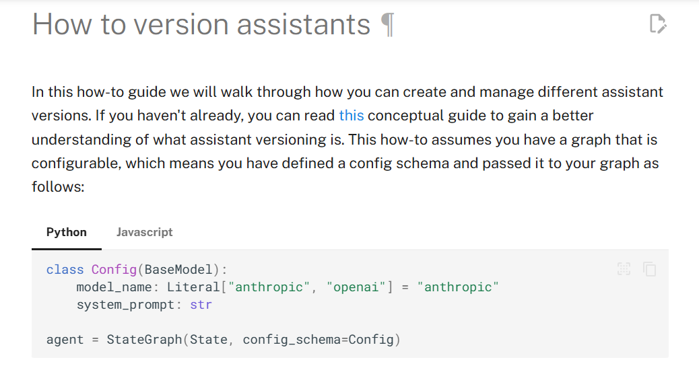    
    
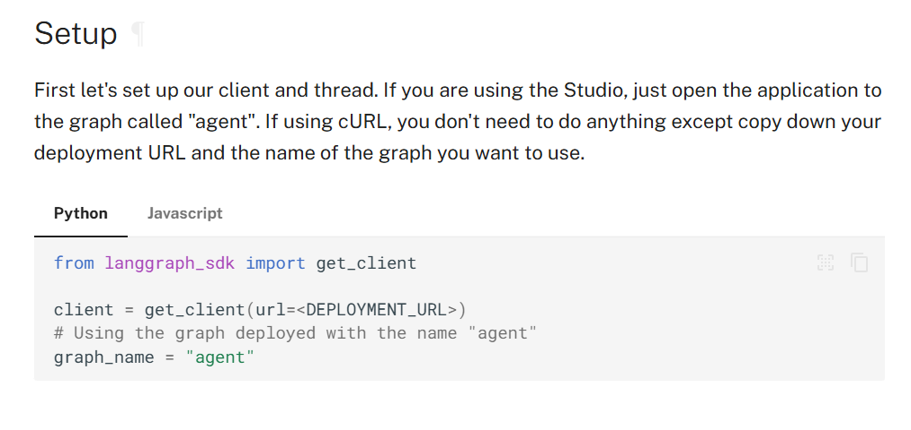

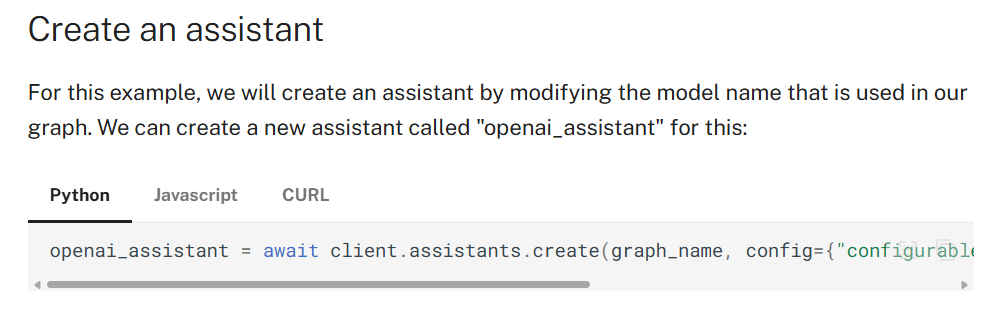

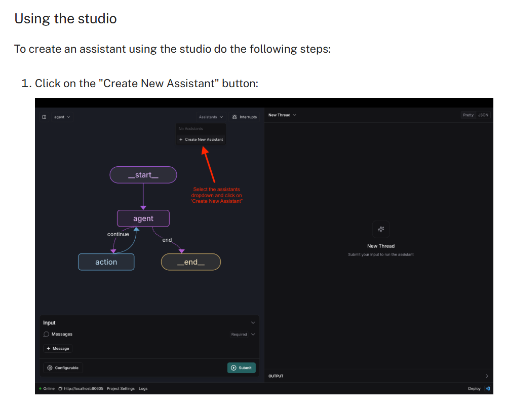

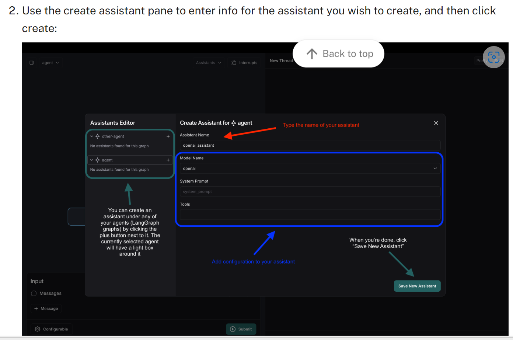

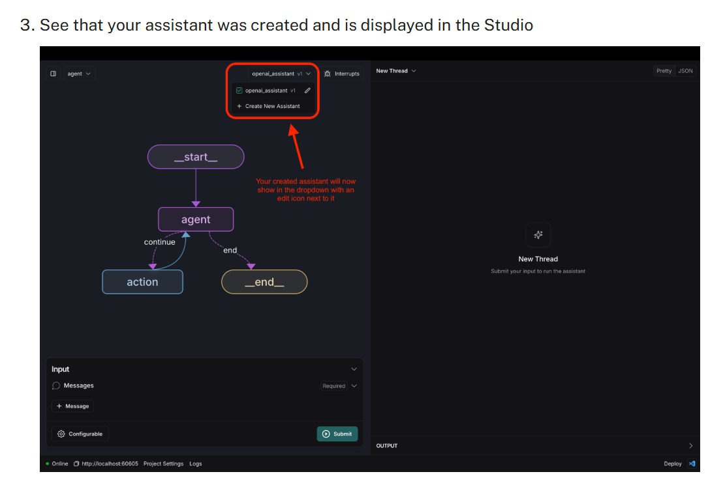

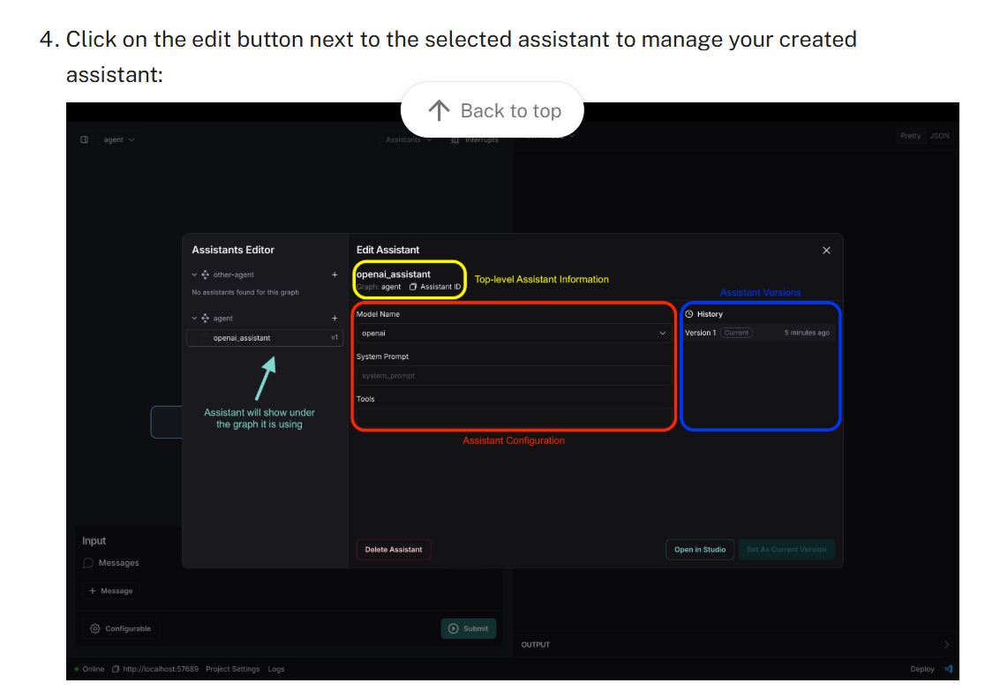

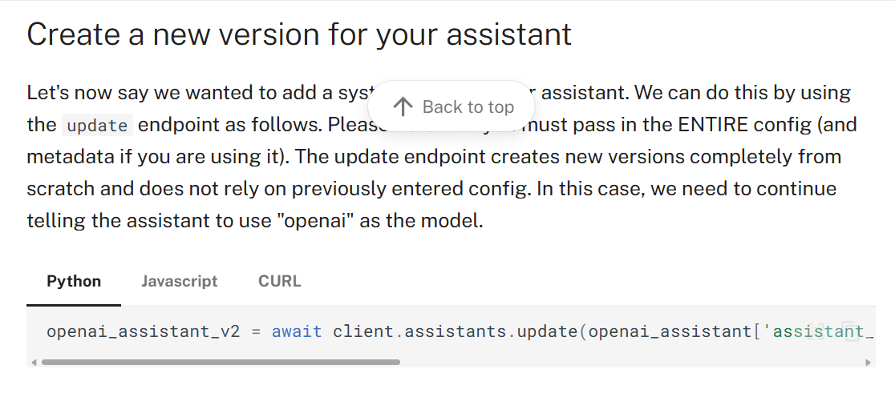

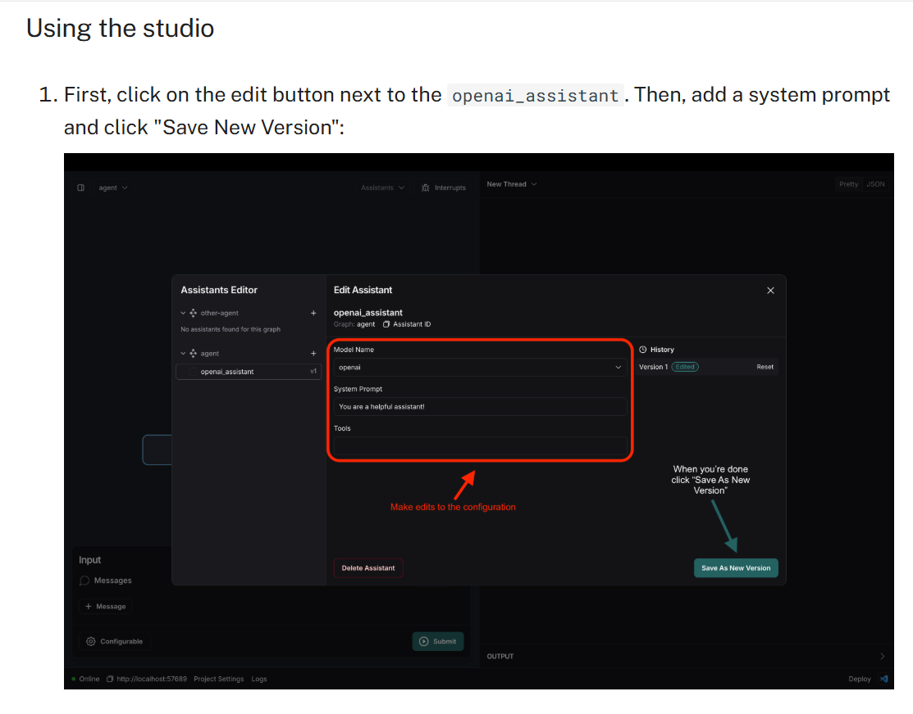

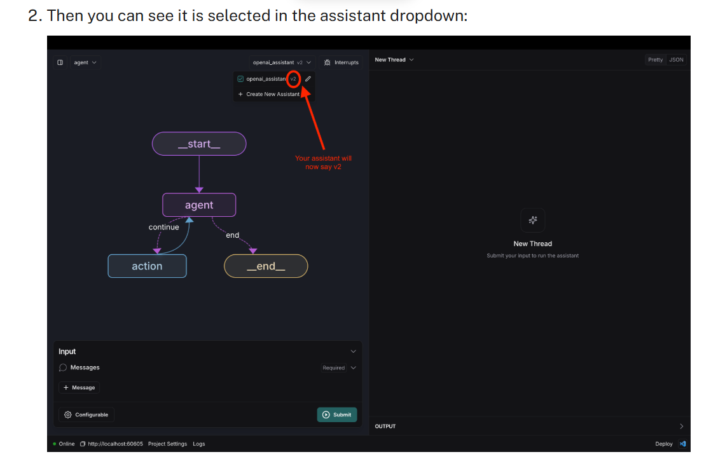

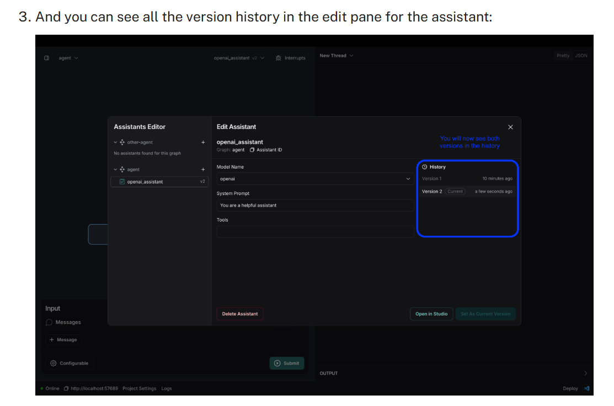

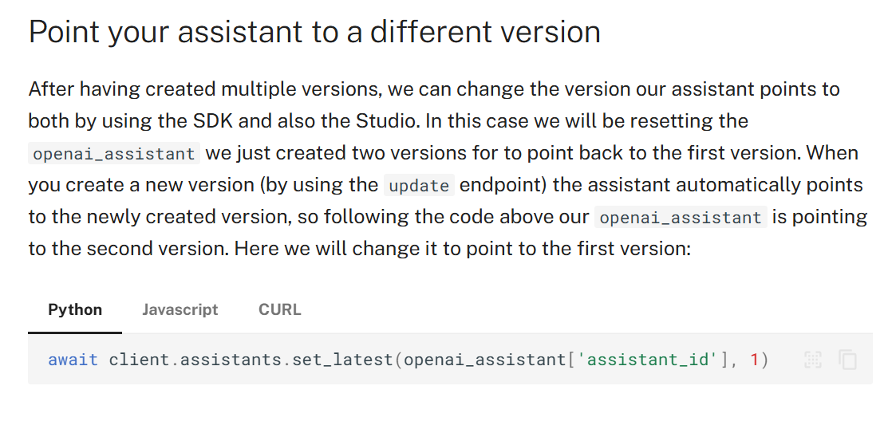
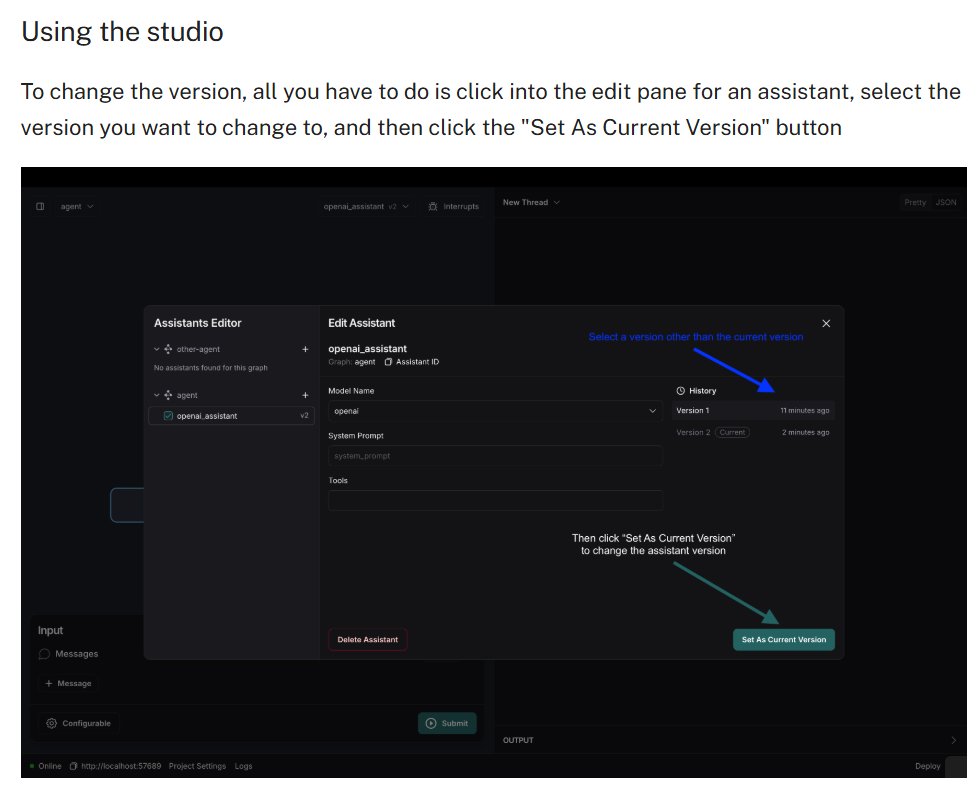

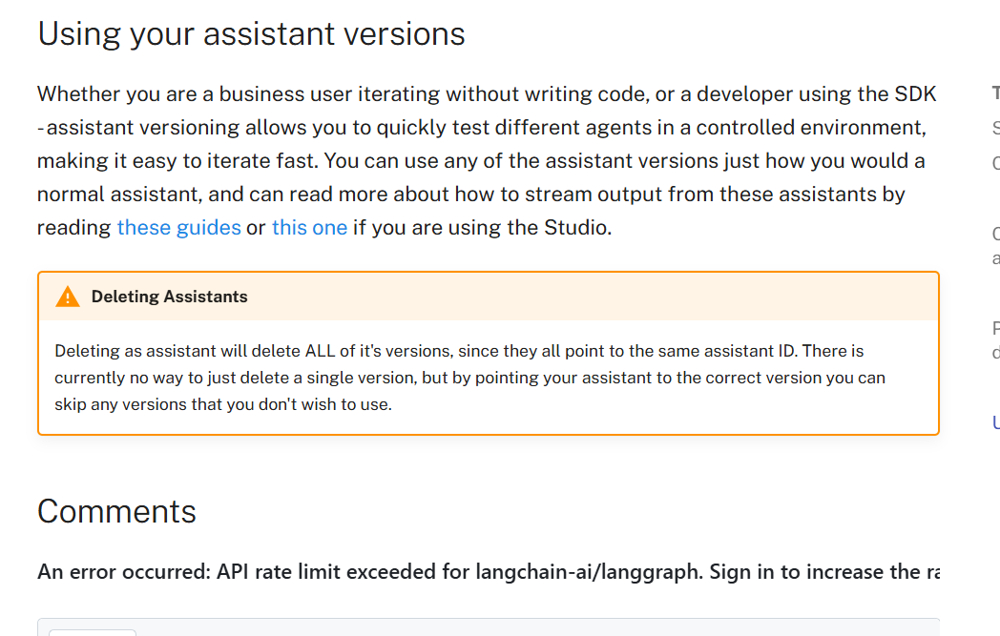